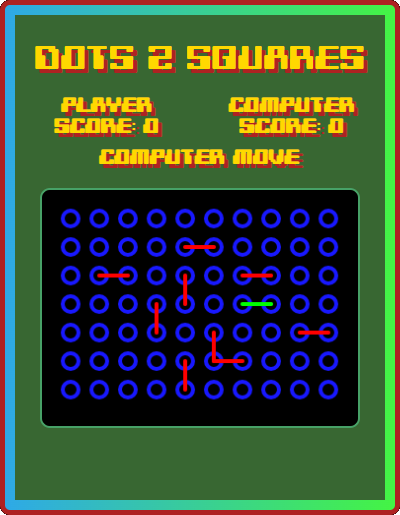

# Dots2Squares
## Overview
Dots2Squares is an HTML Canvas based game with a retro feel.

Originally a two player paper and pencil game presented as a computer game where you play against the computer.

## Rules

Each player takes it in turn to join two neighbouring dots either horizontally
or vertically. A line is then drawn between the two dots.
The player that completes the dots creating a square (2 x 2 dots), captures
the square. The player with the most squares wins. If you or the computer captures a square, the player gets another turn.
